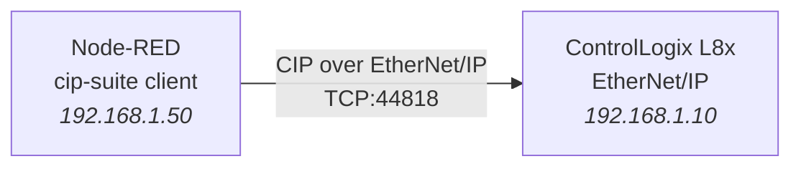
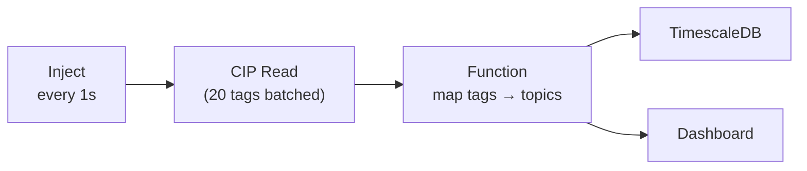

I've written about getting a [Siemens S7 onto a dashboard via OPC-UA](/blog/siemens-s7-opcua-node-red/). But walk into a North American plant and you're far more likely to find an Allen-Bradley PLC — a ControlLogix in the big cells, a CompactLogix on the smaller machines, maybe a dusty SLC 500 still running a line nobody dares touch. And Allen-Bradley doesn't speak OPC-UA out of the box. It speaks **EtherNet/IP** and **CIP**. This is the guide to bridging that gap with Node-RED.

---

## EtherNet/IP and CIP — What You're Actually Talking To

The naming is a trap, so let's clear it up first:

| Term | What it really is |
|------|-------------------|
| **CIP** (Common Industrial Protocol) | The application layer — the "language" of objects, services, and tags. Vendor-neutral, managed by ODVA. |
| **EtherNet/IP** | CIP *over* standard Ethernet/TCP/IP. The "IP" is **Industrial Protocol**, not Internet Protocol. |
| **DeviceNet / ControlNet** | The same CIP, but over different physical layers (CAN, coax). You'll rarely touch these from Node-RED. |

So when you "read a tag over EtherNet/IP," you're really sending a CIP service request (read this object's attribute) wrapped in an EtherNet/IP encapsulation, over TCP port **44818** (explicit messaging) or UDP **2222** (implicit/I/O messaging). For data collection from Node-RED, you want **explicit messaging** on 44818.



---

## The Family — and Why It Matters for Tag Access

The PLC generation completely changes how you address data:

| PLC family | Addressing model | Example |
|-----------|------------------|---------|
| **ControlLogix / CompactLogix (Logix5000)** | **Named tags** | `Machine_Temp`, `Line[2].PartCount` |
| **MicroLogix / SLC 500** | **Data files** | `N7:0`, `F8:12`, `B3:0/4` |
| **PLC-5** | **Data files** (legacy) | `N7:0`, `F8:0` |

Logix5000 controllers are the easy case — symbolic, named tags you can read by name. The legacy SLC/PLC-5 world uses **data file addressing** (`N` = integer, `F` = float, `B` = binary, `T` = timer), which is far less self-documenting. [`node-red-contrib-cip-suite`](/projects/cip-suite/) handles both, but you need to know which world you're in.

---

## Step 1: Find the Path to the Processor

This is the step that trips up everyone coming from Siemens. On a ControlLogix, the Ethernet module and the CPU are **separate modules in a chassis**. A connection lands on the Ethernet module, then has to be *routed* across the backplane to the slot the processor sits in.

```
ControlLogix chassis:
  Slot 0:  L8x Processor      ← your tags live here
  Slot 1:  (empty)
  Slot 2:  EN2T Ethernet      ← your connection lands here

  CIP path:  1,0
             │ └─ slot 0 (the processor)
             └─── backplane port
```

So the **path** is `1,0` — "go out the backplane (port 1) to slot 0." For a CompactLogix, the Ethernet port is built into the CPU, so the path is usually just `1,0` as well (the processor is "slot 0" of its virtual backplane). Get this wrong and you'll get a cryptic timeout, not a helpful error.

| Hardware | Typical path |
|----------|-------------|
| ControlLogix, CPU in slot 0 | `1,0` |
| ControlLogix, CPU in slot 3 | `1,3` |
| CompactLogix (built-in port) | `1,0` |
| MicroLogix / SLC (no routing) | *(none)* |

---

## Step 2: Connect from Node-RED

### Install

```bash
cd ~/.node-red
npm install node-red-contrib-cip-suite
```

### Configure the PLC Connection

```
CIP Endpoint Config
├── Host:        192.168.1.10
├── Port:        44818
├── Slot / Path: 0           (or full path 1,0)
├── PLC type:    Logix5000 | SLC/MicroLogix | PLC-5
└── Timeout:     3000 ms
```

For a Logix controller, "Slot 0" is the shorthand the node expands into the `1,0` path.

---

## Step 3: Read Tags

### Logix5000 — Named Tags

Drop a **CIP Read** node and give it tag names:

```json
{
    "tags": [
        "Machine_Temp",
        "Spindle_Speed",
        "Line_Status",
        "Parts_Produced"
    ]
}
```

The output gives you typed values:

```json
{
    "payload": {
        "Machine_Temp":   42.7,
        "Spindle_Speed":  2450.0,
        "Line_Status":    1,
        "Parts_Produced": 1847
    }
}
```

### Reading Array and UDT Members

Logix tags can be arrays or user-defined types (UDTs). Address members with dot/bracket notation:

```json
{
    "tags": [
        "Line[2].PartCount",          // array element member
        "Recipe.Temperature",         // UDT member
        "Zone_Temps[0]",              // array element
        "Zone_Temps[0..7]"            // array slice (8 elements)
    ]
}
```

**Reading a slice in one request is dramatically faster** than eight individual reads — CIP lets you fetch contiguous array ranges in a single packet.

### Legacy SLC/PLC-5 — Data Files

```json
{
    "tags": [
        "N7:0",        // integer file 7, element 0
        "F8:12",       // float file 8, element 12
        "B3:0/4",      // binary file 3, word 0, bit 4
        "N7:0,10"      // 10 consecutive integers from N7:0
    ]
}
```

---

## Step 4: Write Tags (Carefully)

Writing to a live PLC controlling physical machinery is not something to do casually. But for setpoints and recipe downloads, here's the pattern:

```javascript
msg.payload = {
    tag: "Setpoint_Temperature",
    value: 65.0,
    type: "REAL"          // must match the controller tag type
};
return msg;
```

Wire into a **CIP Write** node. The `type` field matters — writing a `DINT` value to a `REAL` tag (or vice versa) either fails or silently corrupts the value.

```
Logix data type → cip-suite type string:
  BOOL   → "BOOL"
  SINT   → "SINT"    (8-bit signed)
  INT    → "INT"     (16-bit signed)
  DINT   → "DINT"    (32-bit signed)
  REAL   → "REAL"    (32-bit float)
  STRING → "STRING"  (Logix string structure)
```

> **Safety:** Never expose tag writes to an untrusted flow input. Gate every write behind validation (range checks, allowed-tag whitelist) and, ideally, a confirmation step. A typo that writes `6500` instead of `65.0` to a temperature setpoint is a real incident. We'll cover OT network isolation in an upcoming post on [securing OT networks](/blog/securing-ot-networks-opcua-purdue/).

---

## Step 5: Efficient Polling

CIP connections have overhead. Three rules keep your data collection from hammering the PLC:

1. **Batch tags into one read.** One request with 20 tags beats 20 requests with one tag each.
2. **Group contiguous array data into slices.** `Zone_Temps[0..15]` is one packet.
3. **Poll no faster than you need.** Most process data is fine at 500 ms–2 s. Sub-100 ms polling of a ControlLogix over EtherNet/IP adds real CPU load to the controller.



---

## Common Pitfalls & Troubleshooting

### "Connection timed out" but the PLC pings fine

Almost always a **wrong path/slot**. The TCP connection to the Ethernet module succeeds (so ping works), but the CIP route to the processor slot is wrong, so the request never reaches the CPU. Re-check which slot the processor is in.

### "Tag not found" / `0x04` Path Segment Error

```
Checklist:
  [ ] Exact tag name spelling and case? (Logix tags are case-insensitive
      but the leading scope matters)
  [ ] Is it a CONTROLLER tag, not a PROGRAM-scoped tag?
      Program tags need the prefix:  Program:MainProgram.MyTag
  [ ] Does the tag actually exist in the running program (not just offline)?
```

Controller-scoped vs program-scoped is the #1 "but it's right there in Studio 5000" mistake. A tag inside a program routine needs `Program:<ProgramName>.<TagName>`.

### Connection Drops After a Few Minutes

EtherNet/IP explicit connections have a timeout. cip-suite keeps the session alive, but if you see periodic drops, lower the keep-alive interval or enable auto-reconnect:

```
CIP Endpoint Config → Advanced
├── Keep-alive:       enabled
├── Reconnect:        enabled
└── Reconnect delay:  5000 ms
```

### Values Are Wildly Wrong (e.g. 1.4e-44)

You're reading the bytes of a `REAL` as if they were a `DINT`, or vice versa. Confirm the controller tag's data type and set the read/write type to match. This is the EtherNet/IP equivalent of the S7 `Real` vs `LReal` trap.

### Too Many Connections / `0x01` Connection Failure

ControlLogix controllers have a finite number of CIP connections. If multiple SCADA/historian/Node-RED clients all open connections, you can exhaust them. Use **one** connection from Node-RED and batch your reads through it rather than spinning up a connection per flow.

---

## Where This Fits in the Stack

Once tags are flowing into Node-RED, you're in the same world as any other source:

- Normalize Allen-Bradley tags and Siemens tags into a common model and publish to a [Unified Namespace](/blog/unified-namespace-sparkplug-node-red/).
- Stream high-volume data to [Kafka](/blog/kafka-shop-floor-event-streaming/) for plant-tier aggregation.
- Feed counts and states into OEE calculations and dashboards.

The beauty of Node-RED as the integration layer is that the *source* protocol stops mattering once the data is in a message. A ControlLogix tag, an S7 data block, and a Modbus register all become the same kind of `msg.payload` — and everything downstream treats them identically.

---

## Conclusion

Allen-Bradley is the default in huge swaths of manufacturing, and EtherNet/IP + CIP is how you talk to it. The two things that separate a smooth integration from a frustrating one are both conceptual, not technical: understanding that CIP requests must be **routed across the backplane to the processor's slot**, and knowing whether you're in the **named-tag (Logix5000)** world or the **data-file (SLC/PLC-5)** world. Get the path right, batch your reads, match your data types, and gate your writes — and a ControlLogix becomes just another well-behaved data source in your Node-RED flows.
