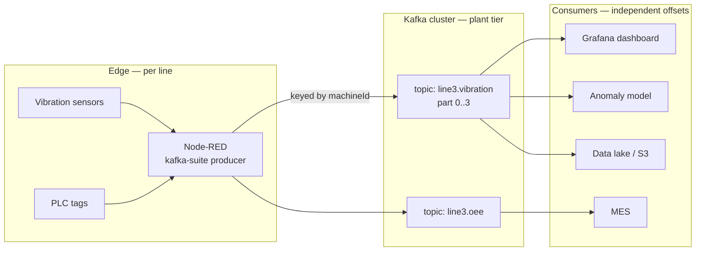
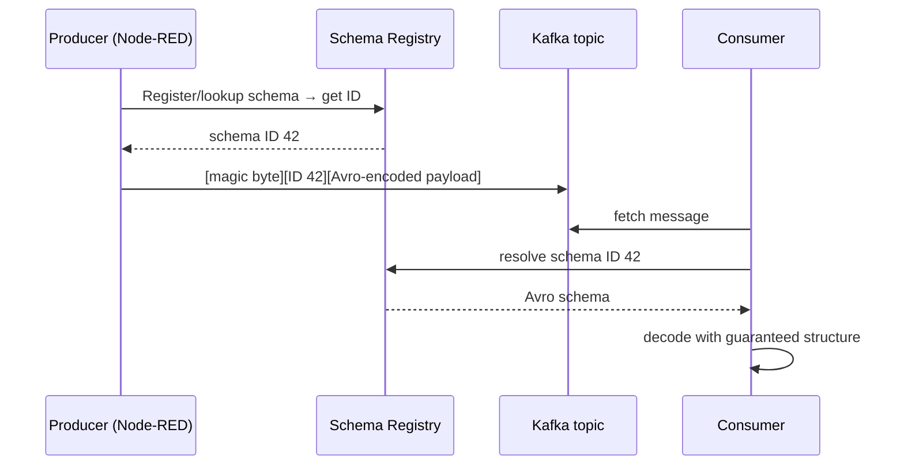

Kafka has a reputation problem in manufacturing. Half the people I talk to think it's the answer to everything; the other half think it's a heavyweight cloud thing that has no business near a PLC. Both are wrong. Kafka is a fantastic tool for a *specific* set of shop-floor problems — and a terrible choice for the rest. This post is about telling the two apart, and then actually wiring Kafka into a Node-RED stack once you've decided it fits.

---

## When Kafka Actually Belongs in a Factory

Kafka is a distributed, append-only commit log. That single property — a durable, replayable, ordered log of events — is what makes it valuable, and it maps to exactly three manufacturing problems:

| Problem | Why Kafka fits |
|---------|----------------|
| **Replay & reprocessing** | A new analytics model needs three months of historical sensor data, run through the same pipeline as live data. Kafka keeps the log; you rewind the consumer. |
| **Fan-out to many consumers** | One vibration stream feeds a dashboard, an ML model, a data lake, and an MES — each at its own pace, none blocking the others. |
| **Buffering bursty, high-volume data** | A line produces 50k events/second during a run. Kafka absorbs the spike; downstream systems drain it when they can. |

If your problem isn't one of those, Kafka is probably overkill. Sending a single setpoint to a PLC? Use [OPC-UA](/blog/siemens-s7-opcua-node-red/). Lightweight device telemetry over a flaky cellular link? Use MQTT. Low-latency request/reply between services? [NATS](/blog/nats-edge-to-cloud-pipeline/) will be simpler and faster.

---

## Kafka vs NATS vs MQTT — The 30-Second Version

I covered the protocol landscape in detail in [MQTT vs Sparkplug B vs NATS vs OPC-UA](/blog/mqtt-vs-sparkplug-vs-nats-vs-opcua/). Here's where Kafka slots in:

| Dimension | MQTT | NATS (JetStream) | Kafka |
|-----------|------|------------------|-------|
| **Primary job** | Device telemetry | Service messaging | Event log / streaming |
| **Retention** | None (last value) | Hours–days | Days–forever |
| **Replay** | No | Yes | Yes (first-class) |
| **Throughput** | Moderate | High | Very high |
| **Footprint** | Tiny | Small | Heavy (JVM) |
| **Ordering** | Per-topic | Per-stream | Per-partition |
| **Best edge fit** | Sensor → broker | Edge mesh | Plant/cloud aggregation |

The pattern I keep coming back to: **MQTT/Sparkplug at the device edge, NATS for the edge mesh, Kafka at the plant or cloud tier** where you aggregate, store, and fan out. They're complementary, not competing.

---

## Mapping Kafka Concepts to the Factory

Kafka's vocabulary is abstract. Here's the translation that made it click for me:

| Kafka term | Factory analogy |
|-----------|-----------------|
| **Topic** | A logical stream — e.g. `line3.vibration`, `line3.oee` |
| **Partition** | A parallel lane within a topic — usually one per machine or sensor group |
| **Offset** | The position in the log — "I've processed up to event 1,847,200" |
| **Producer** | The edge node publishing readings |
| **Consumer group** | A team of workers sharing the load of one topic |
| **Retention** | How long the log keeps events before pruning |

The partitioning decision is the one that matters most. **Ordering is only guaranteed within a partition**, so if you need per-machine ordering, key your messages by machine ID. Don't over-partition: 1 partition per machine is usually right; 200 partitions for a 12-machine line just adds rebalancing pain.



The magic of that diagram: the anomaly model can fall behind by an hour, get redeployed, and **replay from where it left off** — without the dashboard ever noticing. That decoupling is the whole point.

---

## Wiring Kafka into Node-RED

I built [`node-red-contrib-kafka-suite`](/projects/kafka-suite/) precisely because the existing Node-RED Kafka nodes didn't handle Schema Registry, managed-service auth presets, or dual-backend (KafkaJS / node-rdkafka) selection cleanly. Here's the minimal producer setup.

### 1. Install

```bash
cd ~/.node-red
npm install node-red-contrib-kafka-suite
```

### 2. Configure the Broker Connection

```
Kafka Broker Config
├── Brokers:        kafka-1:9092, kafka-2:9092, kafka-3:9092
├── Client ID:      line3-edge
├── Backend:        KafkaJS (pure JS) | node-rdkafka (native, higher throughput)
├── Security:
│   ├── Preset:     Confluent Cloud | Redpanda | Aiven | Self-managed
│   ├── SASL:       scram-sha-512
│   └── TLS:        enabled
└── Schema Registry: https://schema:8081  (optional, see below)
```

The preset dropdown matters more than it looks — getting SASL/TLS right for Confluent Cloud vs a self-managed Redpanda cluster is where most people lose an afternoon. The presets fill in the fiddly defaults.

### 3. Produce a Message

Wire a function node into the Kafka producer:

```javascript
// Key by machine ID so all events for a machine land in the same partition
msg.key = msg.payload.machineId;          // e.g. "M-1142"
msg.topic = "line3.vibration";
msg.payload = {
    machineId: msg.payload.machineId,
    rmsVelocity: msg.payload.rms,          // mm/s
    peakAccel: msg.payload.peak,           // g
    ts: new Date().toISOString()
};
return msg;
```

That's it for fire-and-forget. But raw JSON on a Kafka topic is a time bomb — which brings us to the part everyone skips.

---

## Schema Registry — The Part That Saves You Later

Six months from now, someone renames `rmsVelocity` to `rms_velocity` in the producer, and three downstream consumers silently break. A **Schema Registry** prevents this by enforcing a contract: every message is validated against a registered schema, and schema *evolution* is checked for compatibility before a new version is allowed.



An Avro schema for the vibration event:

```json
{
  "type": "record",
  "name": "VibrationEvent",
  "namespace": "shopfloor.line3",
  "fields": [
    { "name": "machineId",   "type": "string" },
    { "name": "rmsVelocity", "type": "float",  "doc": "mm/s" },
    { "name": "peakAccel",   "type": "float",  "doc": "g" },
    { "name": "ts",          "type": "string", "doc": "ISO-8601 UTC" }
  ]
}
```

With kafka-suite, you point the producer at the registry and select a compatibility mode:

| Compatibility | What it allows | Use when |
|--------------|----------------|----------|
| **BACKWARD** | New schema can read old data | Consumers upgrade first (most common) |
| **FORWARD** | Old schema can read new data | Producers upgrade first |
| **FULL** | Both directions | Strict, regulated environments |
| **NONE** | Anything goes | Never, in production |

Default to **BACKWARD**. Adding an optional field with a default and removing a field are both backward-compatible changes; the breaking change is adding a required field without a default, which the registry will reject *at deploy time* instead of breaking consumers in production.

---

## Delivery Guarantees — Don't Lose a Part Count

Vibration samples are disposable; you can drop one. A part-count increment is not — losing it corrupts your OEE. Match the guarantee to the data:

```
Producer config per use case:

  Disposable telemetry (vibration, temp):
    acks: 1            # leader ack only — fast, occasional loss OK

  Critical counters (parts, batches):
    acks: all          # all in-sync replicas confirm
    enable.idempotence: true
    retries: 10
    max.in.flight.requests.per.connection: 5
```

`enable.idempotence: true` gives you exactly-once *produce* semantics (no duplicates from retries) with negligible throughput cost on modern Kafka. There is rarely a reason not to set it for counter-type data.

---

## Common Pitfalls

### Pitfall 1: One Message Per Sensor Reading

Kafka loves throughput but hates tiny messages sent one at a time — the per-message overhead dominates. **Batch.** Buffer readings in Node-RED and send arrays, or let the client's `linger.ms` (5–20 ms) and `batch.size` do the batching for you. A 10 ms linger can 10× your effective throughput with negligible latency cost.

### Pitfall 2: Treating Kafka as a Database

Kafka is a log, not a key-value store. "Give me the current temperature of machine M-1142" is the wrong question to ask Kafka. Pipe the stream into a state store (a [time-series DB](/blog/nats-edge-to-cloud-pipeline/), or a Kafka Streams/ksqlDB materialized view) and query *that*.

### Pitfall 3: Infinite Retention by Accident

Default retention is 7 days, but it's easy to set `retention.ms: -1` "to be safe" and then watch your brokers fill up. Decide deliberately: hot topics 7–30 days, compacted topics for latest-state, and offload everything else to object storage via a sink connector.

### Pitfall 4: Running ZooKeeper in 2026

If you're standing up a new cluster, use **KRaft** (Kafka's built-in Raft consensus) — no separate ZooKeeper ensemble to operate. Every supported Kafka version now ships it. Lighter, fewer moving parts, especially welcome on a plant-tier server.

### Pitfall 5: Putting Kafka at the Device Edge

A JVM-based broker on a Raspberry Pi gateway is the wrong place. If you need log semantics at the edge, look at **Redpanda** (C++, no JVM, Kafka-API compatible) — but more often, MQTT or NATS at the edge feeding Kafka upstream is the cleaner architecture. See [Docker vs K3s on the shop floor](/blog/docker-vs-k3s-edge-deployment/) for where to draw the edge/plant line.

---

## When NOT to Use Kafka

Be honest with yourself. Skip Kafka if:

- You have **one producer and one consumer** — that's a queue, not a streaming platform.
- You need **sub-millisecond request/reply** — use NATS.
- Your total volume is **a few thousand messages a day** — MQTT + a database is far less to operate.
- **Nobody on the team will own it.** Kafka rewards operational maturity and punishes neglect. An unmaintained cluster is a liability.

---

## Conclusion

Kafka earns its place in manufacturing when you need a durable, replayable event log that fans out to many independent consumers at high volume — historian backfills, multi-model analytics, plant-to-cloud aggregation. It is the wrong tool for simple device telemetry or low-latency control, where MQTT and NATS are lighter and faster.

If you do reach for it: key your partitions by machine for ordering, enforce contracts with a Schema Registry from day one, set delivery guarantees per data criticality, and keep the broker at the plant or cloud tier — not on a gateway. Get those four things right and Kafka becomes the backbone that lets every other system on the shop floor read the same truth, at its own pace.
