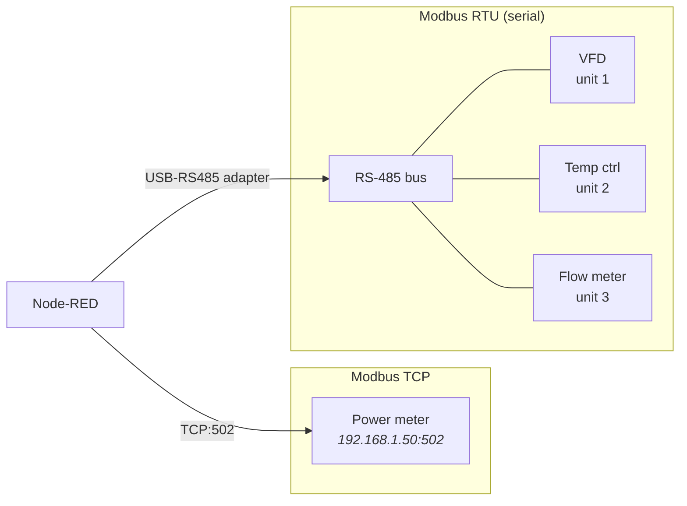

I've written about [OPC-UA](/blog/siemens-s7-opcua-node-red/), [EtherNet/IP](/blog/allen-bradley-ethernet-ip-node-red/), and [a whole zoo of modern protocols](/blog/mqtt-vs-sparkplug-vs-nats-vs-opcua/). But if I had to bet on which protocol you'll actually encounter most often on a real shop floor, my money is on the oldest one in the room: **Modbus**. Designed by Modicon in 1979, it's on power meters, VFDs, temperature controllers, flow meters, HVAC gear, and ten thousand other devices. It's gloriously simple, slightly maddening, and absolutely everywhere. Here's how to talk to it from Node-RED.

---

## Why Modbus Refuses to Die

Modbus survives because it asks almost nothing of a device: a tiny stack, no licensing, no certificates, no information model. If a sensor has a microcontroller and a serial port or an Ethernet jack, it can probably speak Modbus. That simplicity is also its weakness — there's no discovery, no metadata, no built-in typing. You get **numbered registers holding 16-bit words**, and a vendor PDF that tells you what they mean. That's the deal.

| | Modbus | OPC-UA |
|---|--------|--------|
| **Year** | 1979 | 2006 |
| **Self-describing** | No — needs a register map | Yes — browsable address space |
| **Data types** | 16-bit words only (you decode) | Rich, typed |
| **Security** | None (Modbus/TCP) | Encryption, auth |
| **Footprint** | Trivial | Substantial |
| **You'll find it on** | Meters, VFDs, sensors, HVAC | PLCs, modern machines |

---

## The Two Flavors: TCP and RTU



- **Modbus TCP** — Modbus framing over Ethernet, port **502**. One IP per device, addressed directly.
- **Modbus RTU** — the serial original, over **RS-485** (or RS-232). Multiple devices share one bus, each with a **unit ID** (1–247). You reach the bus through a USB-to-RS485 adapter or a serial-to-Ethernet gateway.

The data model is identical between them — only the transport differs. Code that decodes a register map works the same whether the bytes arrived over TCP or a serial line.

---

## The Four Register Types

This is the part the vendor PDF assumes you already know:

| Type | Access | Size | Function codes | Typical use |
|------|--------|------|----------------|-------------|
| **Coils** | Read/Write | 1 bit | 01 read, 05/15 write | Digital outputs, on/off |
| **Discrete Inputs** | Read-only | 1 bit | 02 read | Digital inputs, status bits |
| **Input Registers** | Read-only | 16 bit | 04 read | Sensor readings |
| **Holding Registers** | Read/Write | 16 bit | 03 read, 06/16 write | Setpoints, config, most data |

**90% of the time you want Holding Registers (FC 03) or Input Registers (FC 04).** When in doubt, the register map will tell you which.

### The Addressing Off-by-One Trap

Here is the single most common Modbus mistake. Vendors document registers using **1-based** numbering with a type prefix, but the actual **protocol address is 0-based** and has no prefix:

```
Vendor documents:   40001  (holding register, "4" prefix, 1-based)
Protocol address:   0      (holding register, 0-based)

Vendor documents:   40108
Protocol address:   107

  Rule:  protocol_address = documented_number - 40001   (for 4xxxx)
                          = documented_number - 30001   (for 3xxxx input regs)
```

The same offset rule applies to all four address spaces — coils `0xxxx` (offset = n−1), discrete inputs `1xxxx` (−10001), input registers `3xxxx` (−30001), and holding registers `4xxxx` (−40001).

If every value you read is shifted by one register, this is why. Some Node-RED nodes and some vendors are already 0-based — always read two registers you *know* the values of and confirm the offset before trusting anything.

---

## Reading Modbus from Node-RED

### Install

```bash
cd ~/.node-red
npm install node-red-contrib-modbus
```

### Configure the Connection

**Modbus TCP:**
```
Modbus-Client (TCP)
├── Host:     192.168.1.50
├── Port:     502
├── Unit ID:  1
└── Timeout:  1000 ms
```

**Modbus RTU:**
```
Modbus-Client (Serial)
├── Serial port: /dev/ttyUSB0
├── Baud:        9600       (must match device!)
├── Data bits:   8
├── Parity:      none / even   (check the manual)
├── Stop bits:   1
└── Unit ID:     per device
```

For RTU, **every serial setting must match the device exactly** — a parity mismatch produces silence or garbage, not a helpful error.

### Read Holding Registers

A **Modbus-Read** node configured for FC 03:

```
Modbus Read
├── Function:  FC 03 - Read Holding Registers
├── Address:   0
├── Quantity:  10
└── Poll rate: 1000 ms
```

The raw output is an array of 16-bit unsigned integers:

```json
{ "payload": [427, 0, 2450, 0, 1, 1847, 0, 0, 0, 0] }
```

...which is useless until you decode it.

---

## Decoding: Where the Real Work Is

A 16-bit register holds 0–65535. Real-world values — temperatures with decimals, 32-bit counters, floats — span **multiple registers** and need decoding. This is the part that separates "I got an array of numbers" from "I have a temperature."

### Scaled Integers

The most common pattern: the device stores `427` and the manual says "value × 0.1 °C":

```javascript
const tempC = msg.payload[0] * 0.1;   // 427 → 42.7 °C
```

### Signed 16-bit

Modbus registers are unsigned. A negative temperature comes through as a big number:

```javascript
function toInt16(u) { return u > 32767 ? u - 65536 : u; }
const temp = toInt16(msg.payload[0]) * 0.1;   // 65436 → -10.0 °C
```

### 32-bit Integers and Floats (Two Registers)

A 32-bit value occupies two registers, and **byte/word order is not standardized** — this is the deepest Modbus rabbit hole. The same float can be encoded four different ways:

```javascript
// Combine two 16-bit registers into a 32-bit float
function toFloat32(regs, i, order = "ABCD") {
    const buf = Buffer.alloc(4);
    const hi = regs[i], lo = regs[i + 1];
    switch (order) {
        case "ABCD": buf.writeUInt16BE(hi, 0); buf.writeUInt16BE(lo, 2); break; // big-endian
        case "CDAB": buf.writeUInt16BE(lo, 0); buf.writeUInt16BE(hi, 2); break; // word-swapped
        case "BADC": buf.writeUInt16LE(hi, 0); buf.writeUInt16LE(lo, 2); break; // byte-swapped
        case "DCBA": buf.writeUInt16LE(lo, 0); buf.writeUInt16LE(hi, 2); break; // fully reversed
    }
    return buf.readFloatBE(0);
}
```

| Byte order | Also called | Notes |
|-----------|-------------|-------|
| **ABCD** | Big-endian | Modbus "standard" |
| **CDAB** | Word-swapped / Little-endian byte swap | *Extremely* common |
| **BADC** | Byte-swapped | Rare |
| **DCBA** | Little-endian | Some Schneider/older devices |

If a float reads as nonsense (`1.2e-38`, absurd magnitudes), **try the other word order first** — `CDAB` is the usual culprit. There is no way to detect the right order from the data alone; the manual knows, or you brute-force all four against a known value.

---

## Writing Setpoints

```javascript
msg.payload = {
    value: [650],     // array, even for one register
    fc: 6,            // FC 06 - Write Single Holding Register
    address: 100,
    unitid: 1
};
return msg;
```

For a scaled setpoint, pre-multiply: to write 65.0 °C to a register scaled by 0.1, write `650`. The same write-safety rules from the [Allen-Bradley post](/blog/allen-bradley-ethernet-ip-node-red/) apply — validate ranges and whitelist writable registers. A Modbus write goes straight to the device with zero ceremony.

---

## Common Pitfalls & Troubleshooting

### Everything Reads Zero or Times Out (TCP)

```
Checklist:
  [ ] Right function code? (FC 03 vs FC 04 — input vs holding)
  [ ] Right unit ID? (often 1, but some gateways use 255 or 0)
  [ ] Off-by-one? (40001 → address 0)
  [ ] Device actually on 502? (some use 503, or a custom port)
  [ ] Only ONE client polling? (cheap devices allow 1 TCP connection)
```

### RTU: Silence or Garbage

Serial parameter mismatch, every time. Baud, parity, and stop bits must match exactly. Also check **RS-485 wiring polarity (A/B)** and that the bus has proper **termination resistors** (120 Ω) at both ends on long runs.

### Values Are Shifted by One Register

The 40001-vs-0 addressing trap. Verify against a register whose value you can confirm physically.

### Floats Are Nonsense

Wrong word order — try `CDAB`. See the decoding section.

### Polling Too Fast Drops Responses

Cheap Modbus devices are slow. Hammering a power meter every 100 ms causes timeouts and missed responses. **1–5 second polling** is plenty for most Modbus data, and RTU buses especially need breathing room between transactions.

### One Slow Device Stalls the Whole RTU Bus

On a shared RS-485 bus, requests are serial — a device that's slow to answer (or offline, causing timeouts) delays everything behind it. Keep per-device timeouts tight and consider splitting busy devices onto their own bus.

---

## Bringing Modbus into the Modern Stack

Modbus on its own is a dead end — raw registers nobody else understands. Its value comes from *lifting* it into your wider architecture. Once decoded in Node-RED, a Modbus power-meter reading is just another `msg.payload`, indistinguishable from an OPC-UA tag:

- Normalize it and publish to a [Unified Namespace](/blog/unified-namespace-sparkplug-node-red/) alongside your PLC data.
- Stream high-frequency energy data to [Kafka](/blog/kafka-shop-floor-event-streaming/) for analysis.
- Feed it into [predictive maintenance](/blog/predictive-maintenance-node-red/) or OEE calculations.

That's the quiet superpower of using Node-RED as the integration layer: it turns a 47-year-old protocol with no metadata into a first-class citizen of a modern, event-driven plant.

---

## Conclusion

Modbus is simple to the point of being primitive, and that's exactly why it has outlived every protocol meant to replace it. The protocol itself you'll learn in an afternoon; the *gotchas* are what cost time — the 40001 addressing offset, signed-integer decoding, and the four-way coin flip of 32-bit word ordering. Internalize those three, validate against values you can physically confirm, poll gently, and Modbus becomes a reliable, ubiquitous data source. On a real shop floor, knowing Modbus cold is worth more than fluency in any shinier protocol — because it's the one that's actually on the wall.
