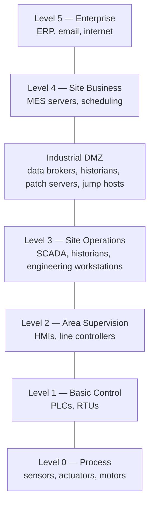
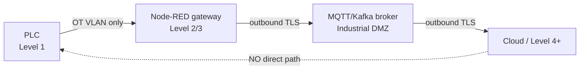

Every other post in this series has been about *connecting* things — [PLCs to dashboards](/blog/siemens-s7-opcua-node-red/), [protocols to brokers](/blog/unified-namespace-sparkplug-node-red/), [edge to cloud](/blog/nats-edge-to-cloud-pipeline/). This one is about the uncomfortable flip side: every connection you add is also an attack surface. Industrial systems were designed in an era of physical isolation, and we've spent the last decade enthusiastically networking them without always asking what that means for security. This is the post I wish more IIoT developers read *before* their first deployment, not after their first incident.

> **Scope:** This is a defensive primer for developers building IIoT systems, not a pen-testing guide. The goal is to help you not be the weak link.

---

## Why OT Security Is Different from IT Security

In IT, the priority order is **Confidentiality → Integrity → Availability**. In OT (operational technology), it's reversed: **Availability → Integrity → Confidentiality**. A web server can reboot for a patch; a PLC controlling a furnace cannot. This single inversion explains almost every cultural clash between IT and OT teams.

| | IT mindset | OT reality |
|---|-----------|------------|
| **Patching** | Patch Tuesday, reboot | "This line hasn't stopped in 3 years" |
| **Lifespan** | 3–5 years | 15–25 years |
| **Downtime** | Annoying | Costs thousands per minute; can be dangerous |
| **Credentials** | Per-user, rotated | Shared, hardcoded, on a sticky note |
| **Protocols** | Encrypted by default | Plaintext by design (Modbus, S7, EtherNet/IP) |

The hard truth: most industrial protocols — [Modbus](/blog/modbus-node-red/), classic S7, [EtherNet/IP](/blog/allen-bradley-ethernet-ip-node-red/) — have **no authentication and no encryption**. Anyone who can reach the wire can read every value and, worse, write setpoints. Security in OT is therefore mostly about *controlling who can reach the wire*. That's segmentation.

---

## The Purdue Model — Your Mental Map

The Purdue Enterprise Reference Architecture (PERA) is the lingua franca of OT segmentation. You don't have to follow it dogmatically, but you need to speak it, because every OT security conversation assumes it.



The key insight: **the Industrial DMZ between Levels 3 and 4 is where IT meets OT, and nothing should cross it directly.** No device on Level 1 should ever talk straight to the internet. Data flows up through brokers and historians sitting in the DMZ; control never flows down from the enterprise.

### Where Node-RED and IIoT Gateways Live

Your [edge gateway](/blog/compulab-iot-gateway-node-red/) typically straddles Level 2/3 — close enough to poll PLCs, positioned to push data *up* into the DMZ. It should **never** be dual-homed straight from the PLC VLAN to the public internet. If it needs to reach the cloud, it publishes to a broker in the DMZ, and the DMZ broker handles the outbound connection.



---

## Practical Segmentation

You don't need a six-figure firewall project to start. In rough order of impact-per-effort:

1. **Put OT on its own VLAN.** The single highest-impact move. PLCs, HMIs, and gateways on a dedicated VLAN, isolated from the office network. If a phishing email compromises an office laptop, it shouldn't be able to reach a single PLC.

2. **Default-deny between zones.** Firewall rules between VLANs should deny everything, then allow only the specific flows you need: "Node-RED gateway → PLC on 4840," "gateway → DMZ broker on 8883." Nothing else.

3. **One-way data flow where possible.** Data diodes (hardware) are the gold standard for high-security sites, but even a well-configured firewall enforcing "DMZ pulls from OT, OT never initiates to enterprise" captures most of the benefit.

4. **A jump host for engineering access.** No direct RDP/SSH from the office into Level 2/3. Engineers go through a monitored, MFA-protected jump host in the DMZ.

```
Minimum viable firewall policy (conceptual):

  OT VLAN (Level 1-2):
    ALLOW  gateway → PLC          tcp/4840, tcp/44818, tcp/502
    DENY   PLC     → internet     any
    DENY   office  → OT VLAN      any

  DMZ:
    ALLOW  gateway → broker       tcp/8883 (MQTT/TLS)
    ALLOW  broker  → cloud        tcp/443  (outbound only)
    DENY   *       → PLC          any
```

---

## Securing OPC-UA Properly

[OPC-UA](/blog/rest-vs-opcua-vs-graphql-manufacturing/) is the rare industrial protocol with real built-in security — but only if you turn it on. The defaults in many tutorials (including, for clarity, the testing steps in my [S7 tutorial](/blog/siemens-s7-opcua-node-red/)) use "No security" to get a first connection working. **That is for the lab bench only.** For production:

| Setting | Lab / testing | Production |
|---------|--------------|------------|
| **Security Policy** | None | `Basic256Sha256` or `Aes256Sha256RsaPss` |
| **Message mode** | None | `SignAndEncrypt` |
| **Authentication** | Anonymous | Username/password or X.509 certificate |
| **Certificates** | Auto-trust | Explicitly exchanged & pinned |

```
OPC-UA production checklist:
  [ ] Security policy Basic256Sha256 minimum (avoid deprecated Basic128Rsa15)
  [ ] Mode = SignAndEncrypt (Sign-only still sends plaintext payloads)
  [ ] Anonymous access disabled
  [ ] Server and client certificates explicitly trusted (no auto-accept)
  [ ] Per-client credentials, not one shared account
  [ ] OPC-UA port reachable only from the gateway VLAN, never the internet
```

The `SignAndEncrypt` vs `Sign` distinction matters: *Sign* guarantees integrity but the payload is still readable on the wire. Use `SignAndEncrypt` unless you have a specific reason not to.

### Securing MQTT / Sparkplug

The same discipline applies to a [Unified Namespace broker](/blog/unified-namespace-sparkplug-node-red/), which by definition carries your entire operation's state:

- **TLS** (port 8883), never plaintext 1883 across zone boundaries.
- **Per-client credentials** — every edge node and subscriber gets its own identity.
- **Topic ACLs** — a dashboard subscriber should not be able to *publish*, and an edge node should only publish under its own branch of the namespace.

---

## The Patching Reality

You will not patch like IT does. A PLC running a line cannot reboot on demand, and a 20-year-old controller may have no patches at all. So you compensate with **compensating controls**:

- **Can't patch the PLC?** Isolate it harder. Tighter firewall rules, no direct access, monitoring on its segment.
- **Virtual patching** — IPS/firewall rules that block the *exploit traffic* for a known CVE even when the device itself stays vulnerable.
- **Maintenance windows** — batch firmware updates into planned shutdowns. Test on a bench identical to production first; a bricked PLC during a patch is its own incident.
- **Asset inventory first** — you cannot protect what you don't know exists. Before anything else, know every device, firmware version, and what talks to what. Passive network monitoring (which doesn't risk disrupting fragile devices) is the safe way to build this.

---

## Common Mistakes I See

### Mistake 1: The Flat Network

Everything on one subnet "because it was easier to set up." One compromised laptop reaches every PLC. Segmentation is the foundation; without it, nothing else matters much.

### Mistake 2: The Dual-Homed Gateway

An IIoT gateway with one NIC on the PLC network and another straight to the internet "for cloud dashboards." You've just built a bridge over your own moat. Route through a DMZ broker instead.

### Mistake 3: Hardcoded and Shared Credentials

`admin/admin` on the HMI, one OPC-UA account shared by five systems, the broker password in a Git repo. Per-identity credentials and a secrets manager aren't IT bureaucracy — they're what lets you revoke access without taking down the plant.

### Mistake 4: "No Security" Left On After Testing

The single most common real-world OPC-UA finding: a server commissioned with `None`/Anonymous for testing, then never hardened. Make production hardening a step in your commissioning checklist, not an afterthought.

### Mistake 5: Trusting the Network Instead of the Message

"It's on the OT VLAN, so it's safe" is necessary but not sufficient. Defense in depth means the *message* is also authenticated and encrypted — so that segmentation failing doesn't mean instant game over.

---

## Conclusion

OT security flips the IT priorities — availability first — and that changes everything about how you approach it. You're defending decades-old devices that often can't authenticate, can't encrypt, and can't be rebooted, so the game is won mostly at the network layer: **segment aggressively (the Purdue model is your map), enforce default-deny between zones, never dual-home a gateway, and route everything through a DMZ.** Where the protocol *does* support security — OPC-UA, MQTT/TLS — turn it on properly and leave it on past the testing phase.

You don't have to do all of it on day one. Putting OT on its own VLAN and enabling `SignAndEncrypt` on your OPC-UA connections already puts you ahead of most deployments I've seen. Security in IIoT isn't a product you bolt on at the end — it's a set of boring, deliberate decisions you make every time you add one of those connections this series has been teaching you to build.
