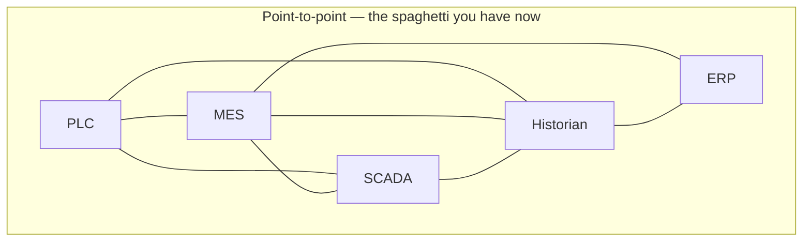
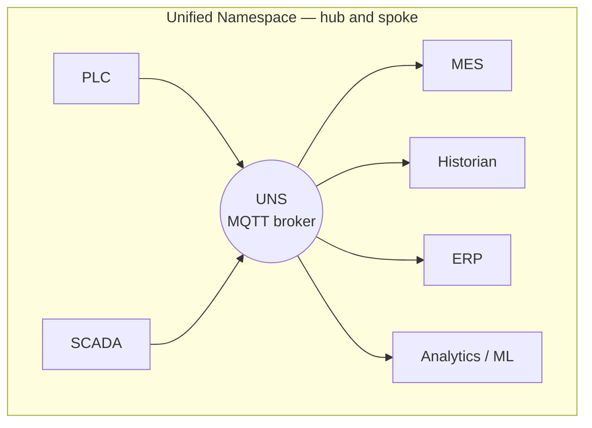
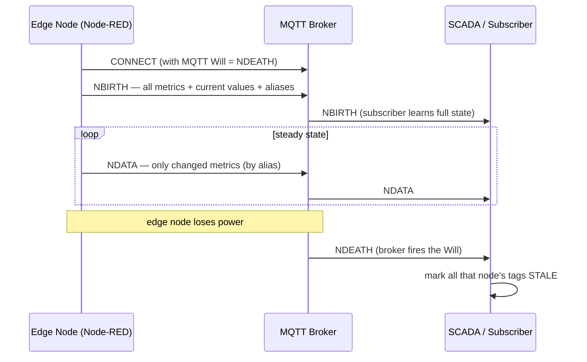
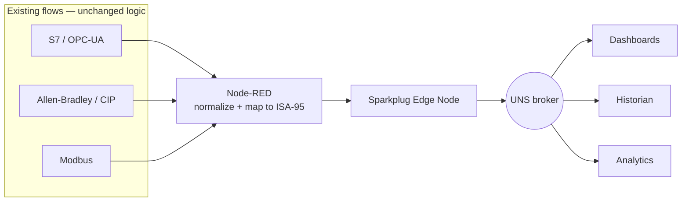

"Unified Namespace" is the most over-hyped and under-explained term in industrial IoT right now. Vendors sell it as a product, consultants sell it as a transformation, and engineers quietly wonder whether it's anything more than "an MQTT broker with good topic names." Having built a few, my honest answer is: it's a *pattern*, not a product — and a genuinely good one. This post strips away the hype and shows how to build a real Unified Namespace incrementally, using [Sparkplug B](/blog/mqtt-vs-sparkplug-vs-nats-vs-opcua/) and Node-RED.

---

## What a Unified Namespace Actually Is

A **Unified Namespace (UNS)** is a single, central, real-time representation of *everything* happening in your business — structured as a hierarchy, accessed via pub/sub, where every system publishes its current state and any system can subscribe to what it needs.

The core idea is a shift from **point-to-point** integration to **hub-and-spoke**:





With *n* systems, point-to-point integration trends toward *n²* connections. A UNS makes it *n*. That's the entire economic argument, and it's a strong one.

Four properties make a namespace "unified":

1. **Single source of truth** — one place that holds the current state of the whole operation.
2. **Edge-driven / report-by-exception** — systems publish *changes*, not polled snapshots.
3. **Self-describing structure** — the topic hierarchy mirrors the physical/logical business (ISA-95 is the usual model).
4. **Open and accessible** — any authorized system can subscribe without a custom integration.

---

## Why Sparkplug B Instead of Plain MQTT

You *can* build a UNS on raw MQTT. People do. But plain MQTT gives you a dumb pipe with three holes that Sparkplug B exists to fill:

| Problem with raw MQTT | Sparkplug B solution |
|----------------------|----------------------|
| No standard topic structure — everyone invents their own | Defined namespace: `spBv1.0/group/message_type/edge_node/device` |
| No way to know if a publisher is alive or dead | **Birth/Death certificates** via MQTT Last Will |
| Payloads are arbitrary blobs | Defined Protobuf payload with typed metrics, timestamps, quality |
| Subscriber that connects late has no current state | **State on connect** — birth certificate carries all current values |

That third and fourth points are the killers. With raw MQTT, a dashboard that connects at 09:00 has no idea what the temperature is until the next time it happens to change. Sparkplug's **birth certificate** publishes the full current state of an edge node the moment it connects, so every late subscriber is immediately up to date.

### The Birth/Death Model



When the edge node dies, the broker automatically fires the **death certificate** (the MQTT Last Will message registered at connect), and every subscriber instantly knows that node's data is stale — no guessing, no timeout heuristics. This single feature is why Sparkplug is worth the extra complexity over raw MQTT for a serious UNS.

---

## The ISA-95 Topic Hierarchy

A UNS lives or dies by its structure. The widely used convention follows ISA-95 levels:

```
Enterprise / Site / Area / Line / Cell / Device / Metric

  acme/germany/stuttgart/assembly/line3/welder1/temperature
  acme/germany/stuttgart/assembly/line3/welder1/state
  acme/germany/stuttgart/assembly/line3/oee/availability
```

Sparkplug overlays its own message-type structure on top:

```
spBv1.0/{group_id}/{message_type}/{edge_node_id}/{device_id}

  spBv1.0/Stuttgart_Assembly/NBIRTH/Line3_Gateway
  spBv1.0/Stuttgart_Assembly/DDATA/Line3_Gateway/Welder1
```

The practical advice: **decide your hierarchy before you publish a single message.** Renaming the structure later means re-pointing every subscriber. Spend the meeting arguing about it up front. Map it to how the *business* thinks about the plant, not how the network happens to be wired.

---

## Building It Incrementally with Node-RED

The biggest myth about UNS is that it's a big-bang project. It isn't — the whole point of the pattern is that it's **additive**. You can stand one up next to your existing systems and migrate one source at a time.

### Step 1: Stand Up a Broker

Any MQTT 3.1.1+ broker with Sparkplug-aware tooling works. EMQX, HiveMQ, and Mosquitto are all fine for the transport; EMQX and HiveMQ have nicer Sparkplug-aware features. Run it in Docker on a plant server — see [Docker vs K3s on the shop floor](/blog/docker-vs-k3s-edge-deployment/) for where to host it.

### Step 2: Make Node-RED an Edge Node

Install a Sparkplug node set:

```bash
cd ~/.node-red
npm install node-red-contrib-sparkplug-plus
```

Configure the edge node identity:

```
Sparkplug Edge Node
├── Broker:       mqtt://uns-broker:1883
├── Group ID:     Stuttgart_Assembly
├── Edge Node ID: Line3_Gateway
└── Devices:      Welder1, Conveyor1, Press1
```

The node handles the protocol mechanics — NBIRTH on connect, registering the NDEATH Will, alias assignment, and Protobuf encoding — so you publish plain values and it does the Sparkplug bookkeeping.

### Step 3: Feed It from Your Existing Sources

This is where your existing flows pay off. You're already pulling data from PLCs:

- [Siemens S7 via OPC-UA](/blog/siemens-s7-opcua-node-red/)
- [Allen-Bradley via EtherNet/IP](/blog/allen-bradley-ethernet-ip-node-red/)
- Modbus, CAN, sensors...

Each of those flows just gets a new endpoint: instead of (or in addition to) writing straight to a dashboard, normalize the value and publish it as a Sparkplug metric.

```javascript
// Take an OPC-UA / CIP reading and emit a Sparkplug metric
msg.payload = {
    device: "Welder1",
    metrics: [
        { name: "temperature", value: msg.payload.temp, type: "Float" },
        { name: "state",       value: msg.payload.state, type: "Int32" }
    ]
};
return msg;
```



### Step 4: Add Consumers, One at a Time

Now anything that wants data subscribes to the broker instead of integrating with each PLC. A new dashboard, a historian, an ML pipeline — each is a subscription, not a project. *This* is the moment the n² → n payoff becomes real and visible.

---

## Common Pitfalls

### Pitfall 1: Treating the Broker as a Database

The UNS holds *current state*, not history. Don't query the broker for "last week's data" — that's a historian's job. Subscribe a time-series store to the namespace and let it accumulate history. Pipe high-volume streams to [Kafka](/blog/kafka-shop-floor-event-streaming/) if you need replayable logs.

### Pitfall 2: Over-Engineering the Hierarchy

Seven ISA-95 levels deep with placeholders for sites you don't have yet creates churn. Model what exists; extend when you grow. A namespace that's painful to read is a namespace nobody uses.

### Pitfall 3: Publishing on a Timer Instead of on Change

Report-by-exception is a defining property of a UNS. Publishing every metric every second "to be safe" turns your elegant event-driven namespace into a polling system with extra steps — and floods subscribers. Publish when values actually change (with a sensible deadband for noisy analog signals).

### Pitfall 4: No Governance

The moment a UNS is useful, everyone wants to publish to it. Without naming conventions, a tag-quality standard, and someone who owns the schema, it degrades into the same spaghetti you escaped — just centralized. Treat the namespace structure as a versioned, reviewed artifact.

### Pitfall 5: Ignoring Security

An open broker carrying your entire operation's state is a juicy target. TLS, per-client credentials, and topic-level ACLs are not optional. This deserves its own treatment — see the upcoming post on [securing OT networks](/blog/securing-ot-networks-opcua-purdue/).

---

## Conclusion

A Unified Namespace isn't a product you buy or a platform you rip-and-replace for. It's a pattern: publish everything that's happening to one well-structured, real-time hub, and let every system subscribe to what it needs. Sparkplug B is the natural transport because it adds the three things raw MQTT lacks — a defined structure, live/dead awareness via birth/death certificates, and full state-on-connect — and Node-RED is the ideal on-ramp because it already speaks every PLC protocol on your floor.

Start small: one broker, one edge node, one source. Add consumers one subscription at a time. The first time a colleague builds a new dashboard in an afternoon — without touching a single PLC — you'll understand why the pattern is worth the hype.
