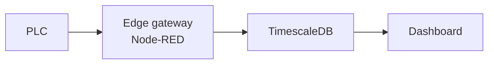

---
# ---------------------------------------------------------------------------
# CASE STUDY TEMPLATE — copy this folder, rename it, fill it in, remove `draft`.
#
#   cp -r content/case-studies/_template content/case-studies/my-study
#
# Every number below has to be one the customer measured or would recognise.
# If a figure cannot be sourced, leave the entry out — a case study with three
# honest numbers is worth more than one with six invented ones, and the rest of
# this site's figures (downloads, versions, test counts) are all verifiable.
# Anonymised is fine: "a tier-one automotive supplier, 40 machines" carries the
# same weight as a name and needs no approval.
# ---------------------------------------------------------------------------
title: "Short outcome-shaped title — what changed, not what was built"
description: "One sentence a stranger understands: for whom, what problem, what result."
draft: true
date: 2026-01-01
weight: 1

# Who it was for. Anonymise as far as you need to.
client: "Tier-one automotive supplier, southern Germany"
sector: "Automotive"
# What you were engaged to do, in the customer's words if possible.
brief: "Get OEE figures out of twelve machines that had no network connection."

# The result band at the top of the page. Two to four entries; each `value`
# must be a measured number, each `label` says what it measures. Drop the
# `before` if there is no clean baseline.
results:
  - value: ""          # e.g. "6 → 2 days"
    label: ""          # e.g. "commissioning per line"
  - value: ""
    label: ""
  - value: ""
    label: ""

# What was actually used. These render as chips and are the fastest way for a
# technical reader to judge whether you have done their problem before.
stack:
  - "Node-RED"
  - "OPC-UA"
  - "Modbus RTU"
  - "TimescaleDB"
  - "Grafana"

# Optional: engagement shape, so a prospect can size their own project.
duration: "6 weeks"
role: "Sole developer, from survey to handover"

tags: ["IIoT", "OPC-UA"]
---

## The situation

What existed before you arrived — machines, controllers, protocols, and how
data was being handled. Be specific about the parts that made it hard: the
1990s PLC with no Ethernet, the vendor licence nobody could find, the plant
network that IT would not open.

## What it cost them

The reason the project was funded. Downtime, manual data entry, a quality
problem nobody could trace. Put the pain in the customer's units — hours per
week, scrap rate, euros per hour of standstill — and say where the figure came
from ("their own maintenance log", "measured over four weeks").

## What I built

The work itself, in enough technical detail that a peer can tell it was real:
which protocols, where the gateway sat, how the data was normalised, what runs
on the edge and what in the plant. Link the relevant articles and packages —
this is where the writing and the code pay off:

- [S7 Suite](/projects/s7-suite/)
- [`node-red-contrib-opcua-suite`](/projects/opcua-suite/)

A diagram helps here. Same fenced block the articles use:

## What changed

The outcome, measured the same way as the cost above so the two are
comparable. If something did not work out, say so — a case study that admits a
constraint reads as an engineer's account rather than a brochure.

## What it took

Timeline, who was involved on the customer side, what you handed over
(documentation, flows, training). This is what a prospect is really trying to
work out: what this would look like for them.
