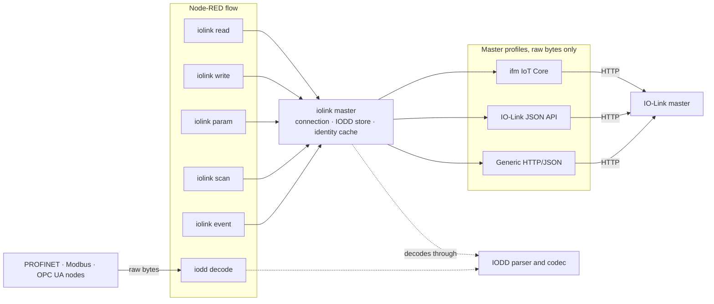

## The Problem

IO-Link is the last metre of the shop floor: the sensor on the cylinder, the valve on the manifold, the pressure switch on the line. An IO-Link master hands that data to Node-RED as raw bytes — `092B0929` — and leaves the rest to you. Which bits are the temperature, whether a raw `2347` means 23.47 °C, what a parameter at ISDU index 100 is called: all of that is written down in the device's IODD, an XML file every vendor publishes and hardly any integration reads. The usual result is a flow full of hand-typed bit offsets and scaling factors that silently breaks when a sensor is swapped for the next revision.

## The Solution

A Node-RED package that reads and writes IO-Link masters and decodes everything **through the IODD**: process data comes out as named, scaled engineering values, actuators are written by name, and ISDU parameters are addressed by their label with the IODD's scaling and enumerations applied in both directions.



```
[ inject ]--->[ iolink read: port 1 ]--->[ debug ]

  msg.payload = {
    "Temperature": 23.47,
    "Counter": 586,
    "SwitchingSignal1": true,
    "SwitchingSignal2": false
  }
```

## Architecture

Six master-bound nodes share one config node, which talks to the master through a vendor profile and decodes through the IODD library. The adapters deal in raw hex only; the decoder has no Node-RED dependency, so the `iodd decode` node works for process data that never touched an IO-Link master at all.



## 7 Nodes

- **iolink master** — Config node, one per physical master: the connection, one shared IODD cache, and the identity cache for every port
- **iolink read** — Process data in from one port or several, decoded, on a message or on an interval; single-message or split-per-value output that maps straight onto MQTT topics
- **iolink write** — Process data out by name, merged into the device's current output so setting one valve leaves the others alone
- **iolink param** — ISDU parameters read and written by name, scaled and with enumerations resolved; read-only and write-only are refused before the device has to
- **iolink scan** — Which ports are occupied, by which device, and whether an IODD was found
- **iolink event** — Port status and device diagnosis, emitting a message only when something changes: a device appearing, a port leaving operate, a wire break
- **iodd decode** — Raw IO-Link bytes decoded or encoded against an IODD with no master involved — for data arriving over PROFINET, EtherNet/IP, Modbus, OPC UA, MQTT or a PLC

## Master Profiles

| Profile | Masters | Interface |
|---------|---------|-----------|
| **ifm IoT Core** | AL13xx, AL19xx, AL2xxx | One POST endpoint, the address in the body |
| **IO-Link JSON API** | Balluff, Pepperl+Fuchs and others | The IO-Link Community's *JSON Integration for IO-Link* (spec 10.222), `/iolink/v1` |
| **Generic HTTP/JSON** | Turck TBEN and any master with a REST API of its own | Request paths are configuration, not code — a new master is a settings entry |

Every profile was built from its interface's documentation and is tested against a stand-in that speaks it. Verification against a master on a bench is still open for each of them, the config dialog says so next to the choice, and `npm run record` captures the raw exchanges with a real master to close that gap. Masters that speak only a fieldbus need no profile: bring the bytes in through the fieldbus node and hand them to `iodd decode`.

## Where the IODD Comes From

1. **An IODD folder** — files are matched by their content, not their filename; a pinned IODD always wins
2. **IODDfinder**, cached on disk — switched off with one tick for an air-gapped plant

A device whose IODD is nowhere to be found is remembered as missing for a configurable retry period, so one unpublished device on a rack does not send a request to IODDfinder on every poll. Several nodes asking for the same IODD at the same moment share one lookup.

## The Decoder

The single most common way to get IODD decoding wrong is to read scaling off the datatype. The datatype only says *16 bit signed*; that a raw `2347` means 23.47 °C is stated in the IODD's user interface section, in one of two places depending on the vendor. The parser reads both.

Two things in real IODDs depend on how the device is currently parameterised, and both are reported rather than guessed:

- **The layout** — a sensor may declare several process data layouts, each guarded by a condition on a parameter. Decoding with the wrong one yields plausible, wrong numbers, so an unselected layout is an error that lists the candidates
- **The scaling** — the same value is often described once per display unit (bar / MPa / psi). Without the selecting parameter the value comes back raw and flagged as ambiguous, rather than silently reporting psi as bar

## Diagnosis

`iolink event` reads the two objects every IO-Link device must provide — `DeviceStatus` (ISDU 36) and `DetailedDeviceStatus` (ISDU 37) — so a message carries whether the device says it is OK, needs maintenance, is out of specification or has failed, with the EventCodes behind that resolved to their meaning. A master that stops answering is its own state rather than every device leaving, and the last known state is carried through the outage.

## Errors

Every failure is prefixed with a code a Catch node can branch on: `IOLINK_MASTER_UNREACHABLE`, `IOLINK_NO_DEVICE`, `IOLINK_NO_IDENTITY`, `IOLINK_OUT_OF_RANGE`, `IOLINK_READ_ONLY`, `IODD_AMBIGUOUS_VARIANT` and so on. An unreachable master is never cached, so the first read after it returns succeeds.

## Quality

- Unit tests with no hardware and no network, against a fake master that speaks the real request and reply envelope
- A Docker integration test that installs the packed tarball into the official Node-RED image, deploys a flow using every node, and checks the decoded values
- The editor halves of the nodes are linted too, and a test checks that every node property has somewhere in its dialog to be set
- A simulator with a plant file: process data encoded through the IODD, values that move, and a control API to pull a device or raise an event while a flow runs
- Published through npm trusted publishing with provenance, Apache-2.0
