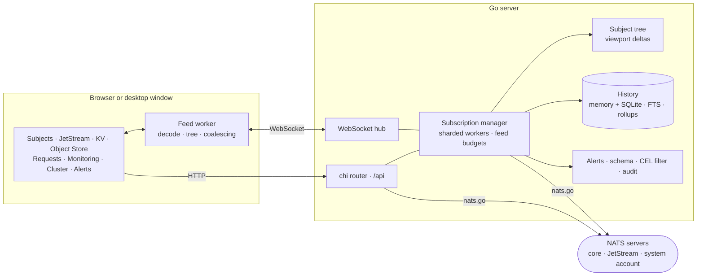

## The Problem

A running NATS server tells you very little from the outside. `nats sub '>'` scrolls past faster than you can read, `nats stream ls` prints a table, and the monitoring endpoint answers with JSON. Which subjects actually exist, what the payload under one of them looked like ten minutes ago, whether the consumer that fell behind is behind on the leaf node or on the hub — every one of those is a different command, and none of them leaves you with a picture you can point at.

MQTT has had [MQTT Explorer](https://mqtt-explorer.com/) for years, and it is the reason an MQTT namespace is something people can talk about in a meeting. NATS had no equivalent.

## The Solution

A **management tool and message explorer for NATS**: the whole subject namespace as a live tree, every message recorded and searchable, JetStream streams, Key-Value buckets and Object Stores editable in place, and the servers, cluster and leaf nodes behind all of it on the same screen.

It ships as a desktop app for Windows, macOS and Linux, and as a web UI served by a single Go binary or a container image — the same server either way, the difference being where the settings live and who can reach the port.



```bash
docker run -p 3002:3002 ghcr.io/blanpa/nats-explorer:latest
```

The UI comes up on port 3002; the connection dialog takes the NATS URL and the credentials.

## Architecture

A Go backend holds the NATS connections and does the work that does not belong in a browser tab — subscribing, counting, keeping the tree, recording the history, evaluating the alert rules. The React client asks for what is on screen over HTTP and receives deltas over one WebSocket. The desktop build is the same server with the same bundle in a native window.



## The Subject Tree

The tree is the part that has to survive a real namespace, so it is kept on the server rather than in the tab:

- **Pull, not push** — a tab receives the messages of the subject or branch it is looking at. Everything else waits in the history and is fetched when selected, so socket traffic and browser memory scale with what is on screen, not with the size of the namespace.
- **Viewport deltas** — a tab sends which branches it has expanded and gets back only the nodes that view shows, plus the nodes that appeared or left on the next change. Collapsing a branch of 100 000 subjects costs nothing after the removal.
- **Feed budgets** — at most 50 msg/s per subject and 2 000 msg/s per tab; within that total the first message of a subject each second wins over repeats, so a wide branch stays fresh instead of one chatty subject starving it. Over-budget messages are counted, not lost — the history still has them.
- **Subtree aggregates** — count, rate and child count roll up the path of every message and refresh on a tick, so a branch shows what is happening under it while it is closed.

## JetStream, KV and Object Store

- **Streams** — create, edit, purge and delete; page backwards from the newest sequence; live tail; consumers managed per stream
- **Key-Value** — browse buckets, edit and purge keys, read the full revision history, and watch a bucket update live from a server-side watch
- **Object Store** — drag and drop in, download out, delete objects and stores
- **Domains** — a connection can target a JetStream domain or API prefix, so a leaf node reaches the hub's JetStream and back, and each pane can switch domains as you go

## Requests

Postman-style request templates in the sidebar: create, edit, duplicate, run, import and export as JSON. A request can be repeated up to 10 000 times across parallel senders with `{{i}}`, `{{ts}}`, `{{uuid}}` and `{{rand:1-100}}` substituted per send, and the result is throughput plus latency percentiles and a histogram of the replies. The publish drawer under a subject uses the same templates, so a one-off publish and a load test are the same object.

## History, Search and Filters

Recorded messages are what turns a live view into something you can investigate:

| Where | What it keeps |
|---|---|
| **In memory** | Bounded by a byte budget (256 MB by default) shared across connections, 1 000 messages per subject, oldest-first eviction |
| **On disk** | `HISTORY_DB` tees every record into SQLite — batched inserts, a bounded queue that drops rather than blocks, retention by age |
| **Time ranges** | A picker from 15 minutes to 7 days shows any past window in the same view as the live feed |
| **Search** | Over one subject and its subtree or across the namespace, answered by an FTS5 index when a persistent history is configured |
| **Long ranges** | Minute aggregates computed in the same write transaction, so a week of a numeric field is a few hundred points on the wire |

On top of that sit two things that read the payloads rather than the envelope. A **[CEL](https://cel.dev/) filter** such as `payload.temp > 80` keeps only the subjects whose last message matches, and narrows the message list, the search, the time ranges and the charts with it. A **derived schema** walks the recorded messages of a subject and reports the fields with their types, presence, ranges and examples — plus a marker when the newer half of the samples has drifted from the older half, which is how you find out a device firmware changed without being told.

## Alerts

Rules watch a subject pattern either for an expression that holds or for a subject that has fallen silent past its `staleAfter`, with severities, an optional webhook, and a dry run against the recorded messages before you arm one. They are evaluated on the backend's record hook — throttled to one evaluation per second and subject, with the per-subject state in a sharded map — so they keep working with no browser open.

## Monitoring and Cluster

Messages and bytes per second in and out, connections, subscriptions, CPU and JetStream API rates over time, plus routes and leaf nodes with their traffic. With system-account (`$SYS`) credentials on the connection the cluster module adds every node with its version, uptime, CPU, memory and JetStream usage, the JetStream meta cluster with its leader, peers, lag and offline members, and the placement of each stream with its leader and replicas. Without those credentials it shows the connected node and says so, rather than pretending the cluster is one server.

## Security

Without `AUTH_TOKEN` or `AUTH_USERS` the backend has no authentication at all and belongs on localhost or a trusted network only. With either, every API and WebSocket request needs a session obtained once through the login and held in an HttpOnly cookie; `AUTH_USERS` adds the roles `admin` and `viewer`, where a viewer cannot publish or change anything. The audit middleware sits between the authentication and the role check, so a refused write is recorded too, and only an admin may read the log.

NATS credentials are held in memory. In the desktop app — and in a server started with `STORAGE_DIR` — connections and templates go to a settings file and the credentials to the system keyring (Secret Service, Keychain, Credential Manager), falling back to a `secrets.json` readable only by the user running the process.

## Support Bundles

A time range plus the server snapshot exports as one zip, and opens again in any other installation as a read-only connection: the recorded messages are pushed through the same shard path as live traffic, so the subject tree, the counters and the history come back as they were. The connection is registered as virtual and refuses every write path at once, which is what makes it safe to hand a bundle to somebody who was not there.

## What It Is Built With

| Layer | Technology |
|---|---|
| Backend | Go 1.26, chi, gorilla/websocket, nats.go, SQLite |
| Client | React 19, TypeScript, Vite, Tailwind, Zustand, Radix UI |
| Desktop | Wails — the same Go server behind the system webview |
| Delivery | Docker image, five server binaries, installers for Windows, macOS and Linux |

## Licence

NATS Explorer is [AGPL-3.0-or-later](https://spdx.org/licenses/AGPL-3.0-or-later.html) rather than MIT like the Node-RED suites: it is an application people run for others, and the licence is what keeps a hosted, modified copy's source available to the people using it. Self-hosting, modifying and using it commercially are all fine.

For the Node-RED side of the same protocol — nodes for publishing, subscribing, JetStream and the KV store inside a flow — see the [NATS Messaging Suite](/projects/nats-suite/), and [NATS as an edge-to-cloud pipeline](/blog/nats-edge-to-cloud-pipeline/) for what the two are usually doing together.
