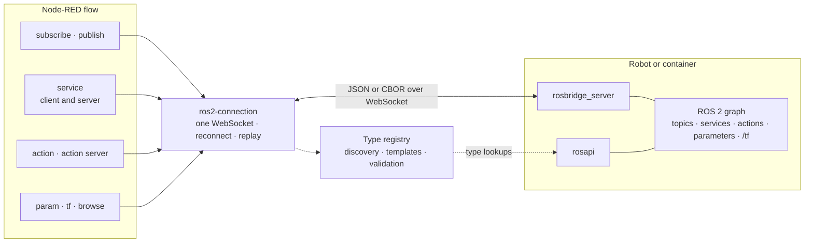

## The Problem

A robot on the shop floor is one more machine whose data and commands belong in the same flows as the PLC next to it — but ROS 2 does not make that easy from the outside. The usual Node-RED packages build on rclnodejs, which wants a full ROS installation of the matching distro on the Node-RED host and a native build against it; that rules out the palette manager, most gateway images and every machine that is not the robot. And once it runs, the first subscription that receives nothing gives no hint whether the topic name is wrong, the publisher is idle or the QoS does not match.

## The Solution

A Node-RED package that talks to ROS 2 through [rosbridge](https://github.com/RobotWebTools/rosbridge_suite) — JSON or CBOR over one WebSocket. Node-RED needs **no ROS installation and no rclnodejs**: install from the palette, point the connection at the robot, and the nodes look up the types themselves.



```
[ ros2 subscribe: /turtle1/pose ]--->[ debug ]        61.9 Hz · turtlesim/Pose

  msg.payload = {
    "x": 5.544, "y": 5.544, "theta": 0,
    "linear_velocity": 0, "angular_velocity": 0
  }
```

## Architecture

Eight nodes share one config node, which holds exactly one WebSocket to rosbridge. Discovery, templates and validation go through rosapi and are cached in a type registry, so the editor and the runtime ask the robot the same questions and get the same answers.



## 9 Nodes

- **ros2-connection** — Config node: host, port and path or a full URL, TLS, an optional bearer token, reconnect backoff and the default service timeout
- **ros2-subscribe** — A topic as messages, with throttle and queue handled by rosbridge so dropped messages never cross the network; the status shows the live rate
- **ros2-publish** — Messages out, validated against the type definition; fills `std_msgs/Header` stamps from system time or from `/clock`
- **ros2-service** — Client mode calls a service; server mode lets a flow *provide* one, answering by wiring back into the same node
- **ros2-action** — Sends goals, with three outputs for feedback, result and status events, plus cancel
- **ros2-action-server** — A flow provides a ROS action, with feedback, result and cancel requests
- **ros2-param** — Get, set, list and describe the parameters of any ROS node
- **ros2-tf** — The transform between two frames — the robot's pose in the map — or the whole frame tree
- **ros2-browse** — Topics, services, actions and nodes of the graph, and a complete default message for any type

## Types Without Typing

The part of ROS 2 that costs the most time from outside is knowing the exact type of everything. Here it is looked up:

- **Auto type detection** — leave the type empty and it comes from rosapi
- **Autocomplete** for topics, services, actions, ROS nodes and parameter names in the editor, with each type shown next to the name — also for a connection that has not been deployed yet
- **Message templates** — a complete default message for any type, one click in the editor
- **Validation** of outgoing messages, requests and goals — field names, JSON types, integer ranges and fixed array lengths — as `strict`, `warn` or `off`

## When Nothing Arrives

A subscription that receives nothing for five seconds checks the graph and says which of two things is wrong:

- **`topic not advertised (did you mean /turtle1/pose?)`** — nothing publishes this name; the node keeps waiting and subscribes as soon as the topic appears
- **`no data — check QoS / publisher`** — the topic exists but is silent, and the debug sidebar gets the likely causes once: an idle publisher, a QoS mismatch, or discovery that works while the data does not arrive

The QoS case is the one that costs an afternoon: rosbridge fixes the QoS of its subscription when a topic is first subscribed through it, and a subscription made against a latched publisher never hears a volatile one that joins later — `/map` from a map server, then a SLAM node. Subscribe and publish nodes carry QoS presets (*default*, *sensor data*, *latched*) or a custom profile to match the publisher explicitly.

## Actions as State Machine Input

The action node's third output is a flat, stable event stream — `sent`, `executing`, `succeeded`, `aborted`, `canceled`, `failed`, `cancel-requested` — so `payload.event` can drive a state machine directly. All outputs keep the properties of the input message, so correlation fields survive, and goals still running when the node is redeployed are cancelled rather than orphaned.

## Binary Data

`uint8[]` fields travel as `Buffer` in both directions. With CBOR encoding, images, laser scans and point clouds arrive as compact binary frames instead of base64 inside JSON, numeric arrays are not spelled out as text, and `NaN` and `Infinity` survive the trip.

## Reliability

- Reconnect with exponential backoff; subscriptions, advertisements and provided services are restored afterwards
- Calls and goals that were running when the connection dropped fail cleanly instead of hanging
- Errors always reach Catch nodes, and the status dot names a concrete next step
- `msg.topic` only overrides a configured name when ticked, so a topic left over from an upstream node cannot redirect a publisher

rosbridge has no authentication of its own: keep its port on a trusted network, or put it behind a reverse proxy — the connection node supports TLS and a token for that.

## Quality

- Unit tests for the client, the type registry and every node against a mock rosbridge that imitates the real one's quirks
- Integration tests against real turtlesim — subscribe in JSON and CBOR, publish, service client and server, action client and server with cancel, parameters, QoS, header stamps, TF, binary data and a reconnect
- CI runs the unit tests on Node.js 18 to 24 and the integration tests on Humble, Jazzy, Kilted and Rolling
- A Docker stack with ROS 2, turtlesim, rosbridge and Node-RED, with the example flow preloaded
- The only runtime dependency is `ws`; published through npm trusted publishing, Apache-2.0

For the PLC side of the same cell, see the [S7 Communication Suite](/projects/s7-suite/) and the [CIP / EtherNet/IP Suite](/projects/cip-suite/).
