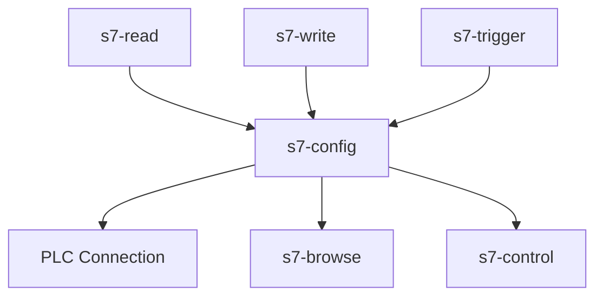

## The Problem

Siemens S7 PLCs are everywhere in industrial automation — but connecting them to Node-RED has always been a trade-off. Pure JavaScript libraries work without native compilation but lack advanced features. Native Snap7 bindings offer full protocol support but are harder to install. And during development, you often don't have a real PLC available at all.

## The Solution

A Node-RED package for Siemens S7 communication that lets you **choose your backend** — pure JS, native Snap7, or a built-in simulator — without changing your flows. Written in TypeScript for type safety and reliability.



## Three Backends, One API

| Backend | Compilation | Best For |
|---------|-------------|----------|
| **nodes7** | None (pure JS) | Easy install, basic S7 communication |
| **node-snap7** | Native (Snap7) | Advanced features, high performance |
| **sim** | None | Development and testing without hardware |

Switch backends in the config node — your flows stay the same.

## 6 Nodes

- **s7-config** — Manages PLC connections with backend selection and auto-reconnection; host, rack, slot, TSAPs and timeouts can each come from an environment variable, so one flow runs against different PLCs
- **s7-read** — Read multiple PLC addresses in a single request, with bulk tag import from TIA Portal and STEP 7 exports
- **s7-write** — Write data to PLC memory with dynamic addressing
- **s7-trigger** — Polling with edge detection and deadband filtering
- **s7-browse** — Discover available data blocks with filtering
- **s7-control** — CPU control operations (start, stop, cold start)

## Supported Controllers

S7-200, S7-300, S7-400, S7-1200, S7-1500, and LOGO!

## Address Formats

Three addressing styles — use whichever you're comfortable with:

- **nodes7-style**: `DB1,REAL0`
- **IEC-style**: `DB1.DBD0`
- **Area-style**: `MW4`, `I0.1`, `QD8`

A number after the offset is an array length — `DB1,INT20.3` is three integers, `DB1,X10.3.8` eight consecutive bits — read as an array and written from one. For a string it is the declared length: `DB1,STRING50.20` is a `STRING[20]` at offset 50.

## Data Types

25 types across the backends, each arriving in Node-RED as the value a flow would want rather than as bytes:

- **Numbers** — `BYTE`, `WORD`, `INT`, `DWORD`, `DINT`, `REAL`, `LREAL`, and the unsigned `USINT`, `UINT`, `UDINT`
- **64-bit integers** — `LINT` and `ULINT` as Number, BigInt or String, chosen per connection, because a JavaScript number is exact only up to 2^53
- **Dates and times** — `DT` and `DTL` as a `Date`, in the PLC's local time or as UTC (`DTZ`, `DTLZ`); `DATE`, `TIME`, `TIME_OF_DAY` and `S5TIME`
- **Strings** — `STRING` and `WSTRING`; a write changes only the current length and characters, never the declared length or the bytes after it

The pure-JS backend covers the common subset and refuses the rest with an error that names the address — never a silent `null`. Snap7 and the simulator support every type.

## Tag Import

Tag lists go into the read node in one step: a TIA Portal tag table export (`.xlsx`, `.xml` or `.sdf`), SimaticML from TIA Portal Openness, STEP 7 symbol exports, or a STEP 7 V5 hardware configuration — the last one without a live PLC connection, which is what makes engineering a flow offline possible.

## Reliability

- Request queuing (max 100 concurrent)
- Exponential backoff reconnection, and a link check while idle so the node status follows the PLC
- A read with some bad addresses still delivers the good ones and names the rest with the reason
- Edge detection for boolean values
- Deadband filtering to reduce noise

## Quality

- Written in TypeScript with strict type checking
- Jest test suite with 80% coverage threshold
- Docker support for containerized deployment
- Twelve of the pull requests in 0.0.9 came from an outside contributor — the editor, both backends, the new data types and the connection handling
